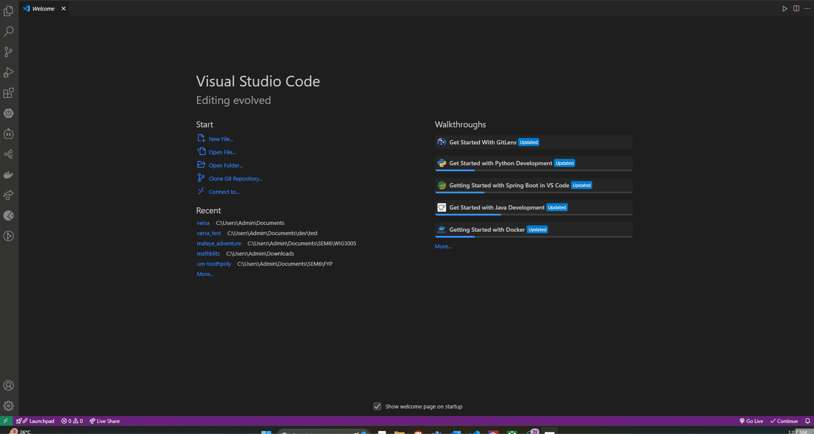
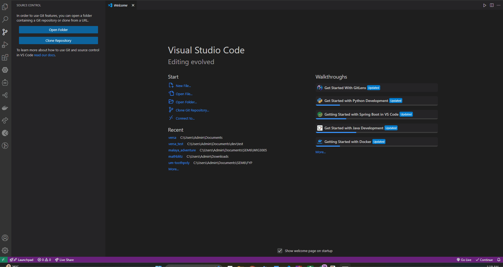
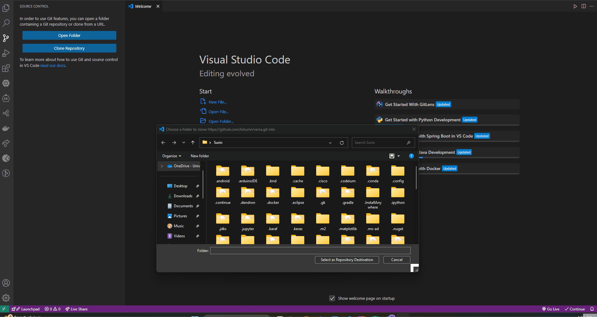
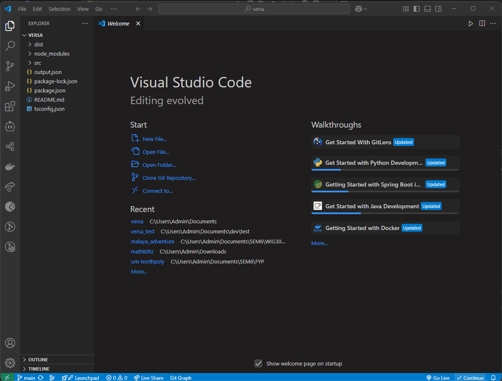
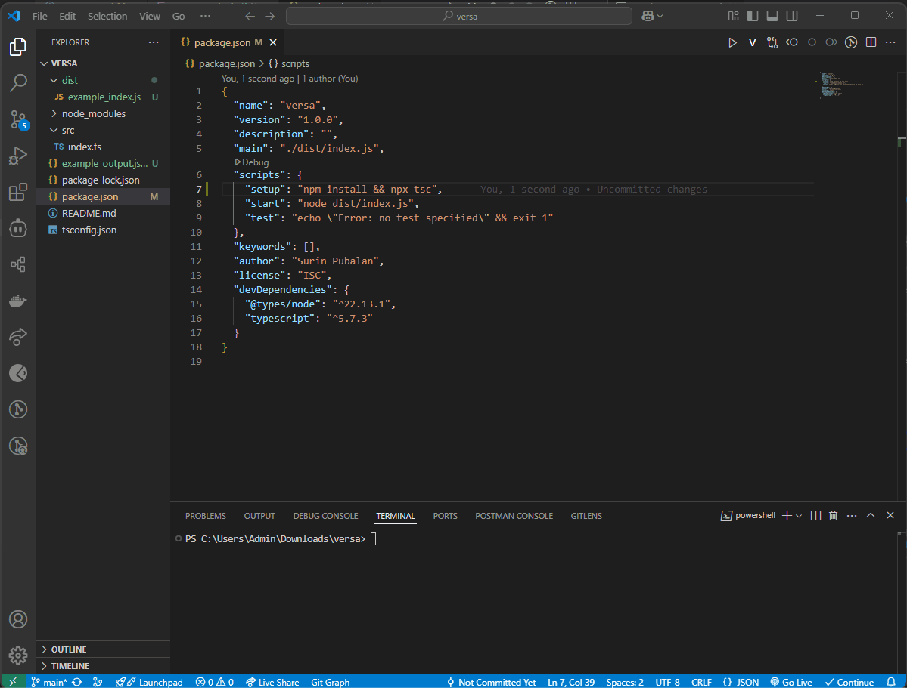
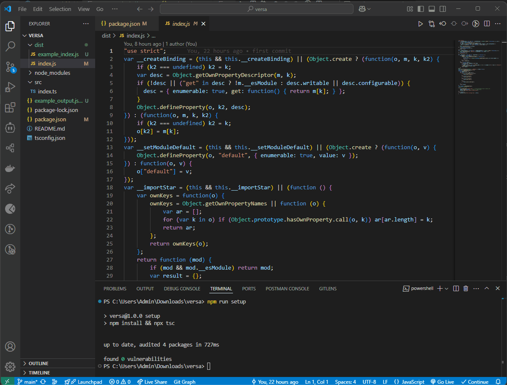

# Challenge #1 Big Bang Solution

The solution generates an array of numbers from 1 to 100, replacing: 
- Numbers divisible by 3 with "BIG"
- Numbers divisible by 5 with "BANG"
- Numbers divisible by both 3 and 5 with "BIGBANG"

## ⚠️ Prerequisites
Make sure you have the following installed on your system:
- [Node.js](https://nodejs.org/) 
- [Git](https://git-scm.com/)
-  [Visual Studio Code](https://code.visualstudio.com/) (recommended)
- A terminal (Command Prompt, PowerShell, or Terminal)

### Installing Node.js and Git for Windows
[](https://www.youtube.com/watch?v=Mzz68OjjFvA)

### Installing Visual Studio Code for Windows
[](https://www.youtube.com/watch?v=cu_ykIfBprI)


## 🛠️ Configuration
1. Clone this repository by copying this URL: https://github.com/lolsurin/versa.git
   
2. Open a new window on Visual Studio Code.

3. Navigate to the Side Bar and click on Source Control.


4. Click on Clone Repository, paste the URL as below and press Enter.


5. Select a folder for the project (for e.g. Downloads) and click Open when prompted.


6. Open a new terminal.


7. Run this command:
    ```sh 
    npm run setup
    ```
    

    #### What does this do?
    This command installs the necessary dependencies and compiles the Typescript file. 
    A Javascript file named **_index.js_** should be generated in your 'dist' directory.

    <u>**Note:**</u> <br>
    **_example_index.js_** file serves as a reference for what the generated **_index.js_** file should contain. 

## ⚡Running the Script
1. Run the script:
    ```sh
    npm start
    ```
    

2. The output will be saved to output.json in the project directory.<br>
    <u>**Note:**</u> <br>
    **_example_output.json_** file serves as a reference for what the generated **_output.json_** file should contain.

## 📜 Output 

    ["1","2","BIG","4","BANG","BIG","7","8","BIG","BANG","11","BIG","13","14","BIGBANG","16","17","BIG","19","BANG","BIG","22","23","BIG","BANG","26","BIG","28","29","BIGBANG","31","32","BIG","34","BANG","BIG","37","38","BIG","BANG","41","BIG","43","44","BIGBANG","46","47","BIG","49","BANG","BIG","52","53","BIG","BANG","56","BIG","58","59","BIGBANG","61","62","BIG","64","BANG","BIG","67","68","BIG","BANG","71","BIG","73","74","BIGBANG","76","77","BIG","79","BANG","BIG","82","83","BIG","BANG","86","BIG","88","89","BIGBANG","91","92","BIG","94","BANG","BIG","97","98","BIG","BANG"]